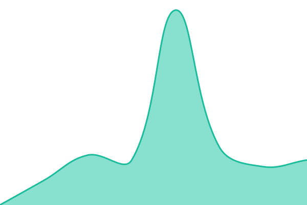

# [📈 Live Status](https://joysulaiman00.github.io/cairn-status): <!--live status--> **🟩 All systems operational**

This repository contains the open-source uptime monitor and status page for [joysulaiman00](https://joysulaiman00.github.io/cairn-status), powered by [Upptime](https://github.com/upptime/upptime).

With [Upptime](https://upptime.js.org), you can get your own unlimited and free uptime monitor and status page, powered entirely by a GitHub repository. We use [Issues](https://github.com/joysulaiman00/cairn-status/issues) as incident reports, [Actions](https://github.com/joysulaiman00/cairn-status/actions) as uptime monitors, and [Pages](https://joysulaiman00.github.io/cairn-status) for the status page.

<!--start: status pages-->
<!-- This summary is generated by Upptime (https://github.com/upptime/upptime) -->
<!-- Do not edit this manually, your changes will be overwritten -->
<!-- prettier-ignore -->
| URL | Status | History | Response Time | Uptime |
| --- | ------ | ------- | ------------- | ------ |
|  [Cairn University](https://cairn.edu) | 🟩 Up | [cairn-university.yml](https://github.com/joysulaiman00/cairn-status/commits/HEAD/history/cairn-university.yml) | 

 229ms
     
 | 

<a href="https://joysulaiman00.github.io/cairn-status/history/cairn-university">100.00%</a>
    

|  [Cairn eLearning](https://elearning.cairn.edu) | 🟩 Up | [cairn-e-learning.yml](https://github.com/joysulaiman00/cairn-status/commits/HEAD/history/cairn-e-learning.yml) | 

 546ms
     
 | 

<a href="https://joysulaiman00.github.io/cairn-status/history/cairn-e-learning">100.00%</a>
    

|  [Cairn Self Service](https://selfservice.cairn.edu/SelfService/Home/LogIn?ReturnUrl=%2FSelfService%2F) | 🟩 Up | [cairn-self-service.yml](https://github.com/joysulaiman00/cairn-status/commits/HEAD/history/cairn-self-service.yml) | 

 366ms
     
 | 

<a href="https://joysulaiman00.github.io/cairn-status/history/cairn-self-service">100.00%</a>
    

<!--end: status pages-->

[**Visit our status website →**](https://joysulaiman00.github.io/cairn-status)

## 📄 License

- Powered by: [Upptime](https://github.com/upptime/upptime)
- Code: [MIT](./LICENSE) © [Anand Chowdhary](https://anandchowdhary.com)
- Data in the `./history` directory: [Open Database License](https://opendatacommons.org/licenses/odbl/1-0/)
